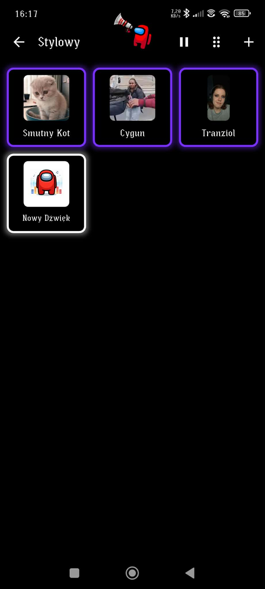

# 🎵 Custom Soundboard App


A feature-rich, fully customizable soundboard application built with **Flutter**. Create dynamic soundboards with custom sounds, icons, layouts, and real-time audio control — perfect for content creators, streamers, and audio enthusiasts.

> **Note:** This project was created as a comprehensive mobile application, primarily written manually with minimal AI assistance for specific technical challenges.

---

## ✨ Features

### 🎛️ **Complete Customization**
- **Visual Theming**: Customize background colors, borders, and text with fine-tuned lightness adjustments (-25% to +25%)
- **Icon Selection**: Use bundled assets or select custom images from your device
- **Layout Control**: Configure grid columns (1-4), button radius, and font sizes per panel

### 🔊 **Advanced Audio Engine**
- **Volume Boosting**: Individual volume control per sound (0-200%+)
- **Earrape Mode**: Global 2x volume amplification for all sounds
- **Audio Clipping**: Trim sounds to play only specific segments (start/end time)
- **Concurrent Playback**: Play multiple sounds simultaneously with smart memory management
- **Instant Stop**: Stop all playing sounds with one tap

### 🎨 **Intuitive UI/UX**
- **Drag & Drop**: Reorder both menu panels and sound buttons
- **Long-Press Editing**: Quick access to customization overlays
- **Real-Time Preview**: See color and layout changes before saving
- **Blur Overlays**: Modern modal editors with backdrop blur effects

### 💾 **Persistent Storage**
- **Local Database**: All configurations saved using Hive (NoSQL key-value storage)
- **File Management**: Automatic cleanup of orphaned audio and image files
- **Import/Export**: Copy user files to app directory with validation

---

## 🏗️ Architecture

### **Design Pattern**
- **Singleton Audio Engine**: Centralized sound management with lifecycle control
- **Stateful Widgets**: Reactive UI updates with proper state management
- **Service Layer**: Separation of concerns (Database, Audio, UI)
- **Custom Widgets**: Reusable components (CustomButton, SoundboardButton, color utilities)

### **Project Structure**
```
lib/
├── Models/              # Data models (MenuButton, SoundData)
├── Pages/               # Main screens (Menu, SoundboardPage)
├── Services/            # Business logic (DatabaseService, SoundEngine)
├── Utils/               # Utility functions (color_utils)
└── Widgets/             # Reusable UI components (CustomButton)
```

### **Key Technologies**
- **UI Framework**: Flutter (Dart)
- **Audio Playback**: just_audio package
- **Local Storage**: Hive (NoSQL database)
- **Image Handling**: image_picker, image_cropper
- **File Management**: file_picker, path_provider
- **Permissions**: permission_handler

---

## 🎵 Audio Engine Details

The custom audio engine (`SoundEngine`) provides advanced playback capabilities:

### **Volume Amplification**
For volumes >1.0, the engine spawns multiple concurrent audio players:
- Volume 1.5 = 1 player at 1.0 + 1 player at 0.5
- Volume 2.3 = 2 players at 1.0 + 1 player at 0.3
- This simulates loudness beyond hardware limits

### **Memory Management**
- Automatic disposal of completed players via stream listeners
- Concurrent player limit (50 max) with oldest-player removal
- Cleanup of dead players before new playback starts

### **Audio Clipping**
- Set custom start/end times for each sound
- Test clips in real-time before saving
- Duration loaded automatically from audio files

---

## 🎨 Color System

The app uses a unique two-layer color system:

1. **Base Color**: Selected from a palette or custom hex value
2. **Lightness Offset**: Applied adjustment (-25 to +25 percentage points)

This approach allows users to pick a color and then fine-tune its brightness independently, providing more control than traditional color pickers.

**Implementation**: RGB → HSL conversion → lightness adjustment → RGB output

---

## 📦 Dependencies

```yaml
dependencies:
  flutter:
    sdk: flutter
  
  # Audio
  just_audio: ^0.9.40
  audioplayers: ^6.1.0
  
  # Database
  hive: ^2.2.3
  hive_flutter: ^1.1.0
  
  # File Management
  image_picker: ^1.1.2
  image_cropper: ^8.0.2
  file_picker: ^8.1.4
  path_provider: ^2.1.4
  path: ^1.9.0
  
  # Permissions
  permission_handler: ^11.3.1
```

See [`pubspec.yaml`](pubspec.yaml) for the complete dependency list.

---

## 📸 Screenshots

### App Icon


### Main Menu


The main menu displays soundboard panels with custom icons and colors. Tap a panel to open its soundboard, long-press to edit, or use the **+** button to create new panels. Drag the handle on the right to reorder.

### Panel Editor


Customize panel appearance:
- Name and icon
- Grid columns (1-4)
- Background, border, and text colors with lightness sliders
- Real-time color preview

### Soundboard View


Main soundboard interface:
- **Earrape toggle** (top center) for global volume boost
- **Back button** and panel title (top left)
- **Stop all** button (top right)
- Sound buttons in customizable grid layout
- **+** button to add new sounds
- Drag handles for reordering

### Sound Editor


Configure individual sounds:
- Custom icon and label
- Background, border, and text colors
- Font size and volume sliders (0-200%)
- Audio file selection
- **Audio clipping**: Set start/end times with range slider
- Test playback button to preview changes

---

## 🗂️ Database Schema

### MenuButton (Hive TypeId: 0)
```dart
{
  id: int,
  text: String,
  icon: String,
  gridColumns: int,
  backgroundColor: String,        // Hex color
  backgroundColorLightness: int,  // -25 to +25
  borderColor: String,
  borderColorLightness: int,
  textColor: String,
  textColorLightness: int,
  sounds: List<SoundData>,
  buttonRadius: double?,
  fontSize: double?,
  earrapeEnabled: bool?
}
```

### SoundData (Hive TypeId: 1)
```dart
{
  id: int,
  label: String,
  iconPath: String,
  soundPath: String,
  volume: double,
  borderColor: String,
  borderColorLightness: int,
  backgroundColor: String,
  backgroundColorLightness: int,
  textColor: String,
  textColorLightness: int,
  textSize: double,
  startTime: double?,  // Audio clip start (seconds)
  endTime: double?     // Audio clip end (seconds)
}
```

---

## 🐛 Known Issues

- Audio playback may be delayed on some older Android devices
- Image cropper UI may not match system theme on all devices
- File size limit (50MB) enforced for copied media

---

## 👤 Author

**Krystian Strzępek**

- GitHub: [@Rghjr](https://github.com/Rghjr)
- Email: krystianstk2000@gmail.com

---

## 📄 License

```
Copyright (c) 2025 Krystian Strzępek

This project is for educational and portfolio purposes only.
All code, assets, and documentation are proprietary and may not be used,
copied, modified, or distributed for commercial purposes without explicit
written permission from the author.

For inquiries regarding commercial use or licensing, please contact the author.
```

---

## 📞 Support

If you have questions or suggestions:
Open an [issue](https://github.com/Rghjr/AmoBoard-Flutter/issues)

---

**⭐ If you found this project helpful, please consider giving it a star!**
